# Asteroids

As a sort of capstone project in my math course, I was tasked with making the classic game asteroids using the p5js framework. This marked the first time I made a full game without an engine to support me. Although this was a daunting task at first, it ended up being really fun to architect all of the systems myself.

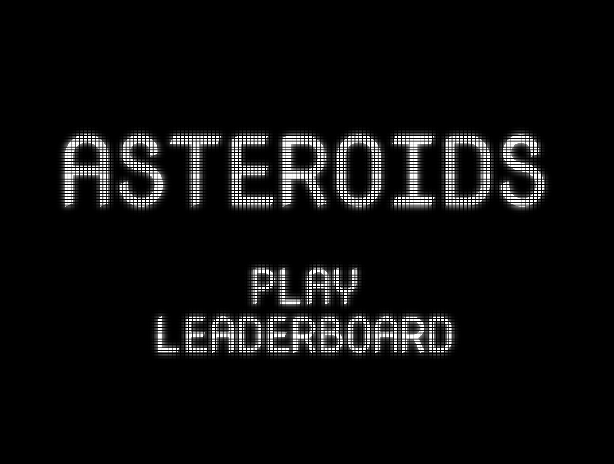

# Starting Point

When I first started this assignment, I decided not to worry about the gameplay of the game. I know this may seem counter intuitive, but I first wanted to start with all of the menu screens. These were the start screen, leaderboard screen, and game over screen.

I needed some way to decide which one of these screens I wanted to be rendering, and so I decided to use an enum along with a switch statement to decide which one to render.

The first problem I encountered with the approach was that javascript didn’t have an enum I could use, so I created my own object to act as an enum.

```jsx
let states = {
  current: 0,
  main: 0,
  game: 1,
  leaderboard: 2,
  gameOver: 3,
};
```

The current value of the object was the one to be switched on, and I would be checking it against all of the other values to determine which screen to show.

```jsx
switch (states.current) {
  case states.main:
    main.draw();
    break;
  case states.game:
    game.update();
    break;
  case states.leaderboard:
    leaderBoard.draw();
    break;
  case states.gameOver:
    gameOver.draw();
    break;
}
```

Once I had this system in place, it was now a matter of actually setting up these screens to display things and be interactable.

I made an individual .js script for each of the screens to keep things tidy. In my main script I create an object off of each of these scripts.

## Button Class

When I was making the main menu, I realized that having a button class would be useful since all of my UI elements would need at least one button.

I decided that all of my buttons would be text based, so I set out to find the bounds created by the text. The value of the text size ends up being equal to the height of the text, which makes that value easy to get. The width of the text can be found using a built in textWidth function in p5js. Before using it, I have to make sure to set the text to the correct size, or it’ll return the wrong width.

I then drew a bounding box around coordinates I got. I found the that text was always offset 7 units from where the bounding box would draw, so I simply move the text over by 7 for it to draw correctly.

I made a function that returns a true boolean if the mouse position is within the bounds of the button. I then check that boolean and if it is true change the color of the button slightlighy in order to give some visual feedback.

```jsx
drawingContext.shadowColor = color(255);
if (this.hovered(mPos)) {
  fill(170);
  drawingContext.shadowColor = color(170);
}
```

When creating the button objects, I pass in a lambda function that can be called when the button is pressed. I also use a lock boolean to make sure a button will not trigger its function multiple times in one click.

```jsx
if (mouseIsPressed) {
  if (!this.hovered(mPos)) {
    this.lock = true;
  } else if (!this.lock) {
    this.f(); //execute funcion when the button is clicked
    this.lock = true;
  }
} else {
  this.lock = false;
}
```

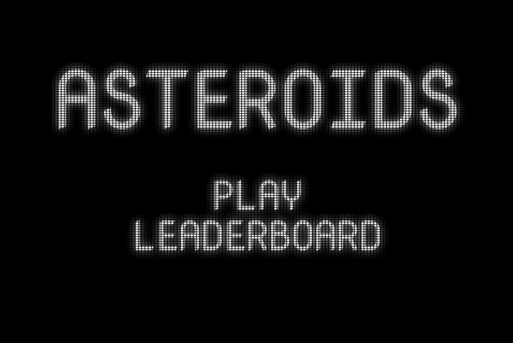

With this button class implemented, I now have the ability to simply add mouse clickable buttons anywhere on the screen with the hitbox automatically fitting to the text.

I keep track of all buttons on a given screen in an array, each button has an anonymous function assigned to it for it to trigger. In this case the button simply change the game state to the leaderboard state, which changes the currently displayed screen to the leaderboard.

```jsx
this.buttons = [];
this.buttons.push(
  new Button(0, 25, 50, "LEADERBOARD", () => {
    states.current = states.leaderboard;
  })
);
```

The buttons are then looped through every frame, they are process the mouse coordinates to know if they are being interacted with, and then are drawn to the screen

```jsx
this.buttons.forEach((b) => {
  b.processMouse(this.mouse());
  b.draw();
});
```

# Game Over

It might seem counterintuitive to create the game over screen before making the playable portion of the game, but I wanted to get everything else out of the way before making gameplay. This way I could focus more on gameplay programming without getting distracted.

I wanted my game over screen to feel like a proper arcade game over screen, so my design involved a score prominently displayed on the screen, as well as an input field for a three letter initial.

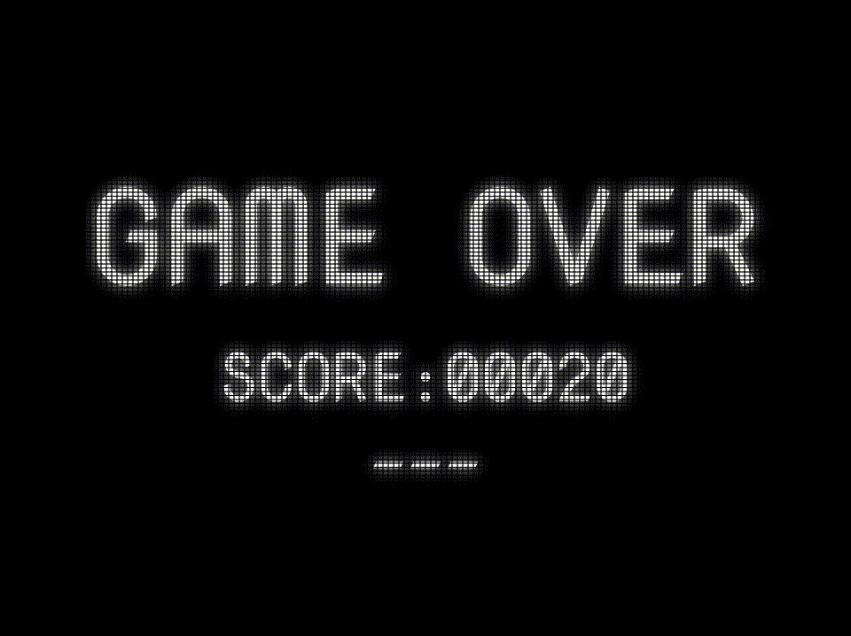

When I first started making the game over screen, I simply used a random placeholder value for the score, but later had the game pass the player’s score when switching screens.

The main challenge with the game over screen was making the text input simple and intuitive.

I started by getting the necessary keyboard input from the player, that being any alphabetical character and backspace

```jsx
processKeyboard(keyCode) {
  if (keyCode == 8) {
    //backspace removes a character
    this.initials = this.initials.slice(0, -1);
    this.textPos = constrain(this.textPos, 0, 2);
  } else if (keyCode >= 65 && keyCode <= 90) {
    //any alphabetical character is added to the string
    this.initials += char(keyCode);
    this.initials = this.initials.slice(0, 3);
  }
}
```

Then I do a check to see how many characters the player has entered into their initials.

If the amount of initials is less than the desired three, I put together a string made out of underscores, with the leftmost one being replaced with a space periodically to signal which space is currently being typed in. This string contains as many underscore as would be needed to fill the three slots including the letters that have been entered.

```jsx
for (let i = this.initials.length; i < 3; i++) {
  if (i == this.initials.length) {
    if (frameCount % 60 <= 30) {
      t += "_";
    } else {
      t += " ";
    }
  } else {
    t += "_";
  }
}
```

At this point in my code, I now have two seperate strings, one the player entered and one that I generate, the combined character count of these two should be three, so I combine them together and display them on the screen.

```jsx
text(this.initials + t, 0, 50);
```

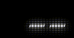

Once I detect that the player has entered three characters for their initials, I render a button on the screen to go to the next screen, that being the leaderboard.

This button does a couple more things than the other buttons previously have. First it pushes a score object to an array of scores, that object containing the score and the initials associated with it. Then I sort this array based on the value of the scores, highest scores going to the top of the array. Finally I store the array to the local storage of the browser so that it can be recalled on future play sessions before switching the screen to being the leaderboard screen.

```jsx
//button gets an anonymous arrow function to execute on click
this.b = new Button(0, 125, 40, "NEXT", () => {
  //add the score to the scores array
  this.scores.push({
    name: this.initials,
    score: this.score,
  });

  //sort the scores
  this.scores = this.scores.sort(({ score: a }, { score: b }) => b - a);
  //store the scores in local storage
  storeItem("scores", this.scores);

  //change screen to the leaderboard
  states.current = states.leaderboard;
});
```

# Leaderboard

The leaderboard screen is comparatively simple because it does not require any player input.

The idea for the layout was to have a large title proclaiming that you are in fact looking at the leaderboard. Then all of the scores should be available in a nice organized list underneath.

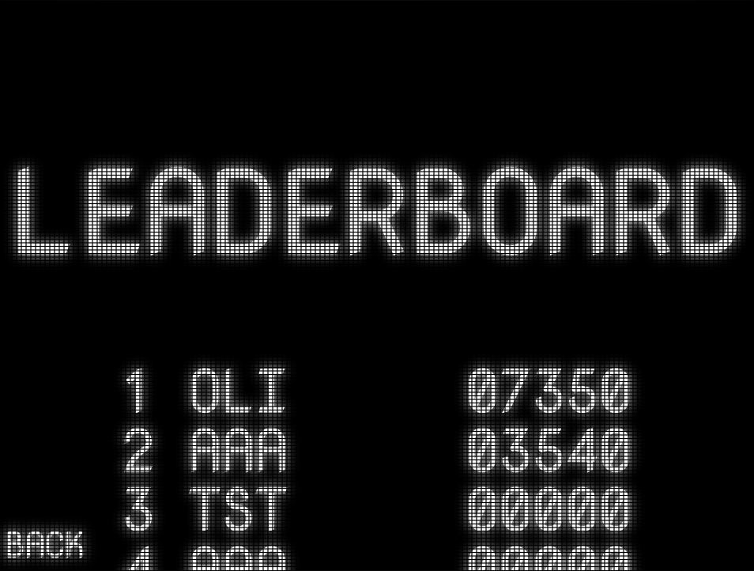

Luckily, I already have access to an array of all the scores on the current machine, and they also happen to be sorted. So displaying the scores is as simple as looping through that array, and doing a little bit of text formatting to make sure everything looks consistent.

```jsx
//foreach score, draw it to the screen and then translate down to draw the next one
for (let i = 0; i < this.scores.length; i++) {
  textAlign(RIGHT);
  text(i + 1 + " " + this.scores[i].name, -75, 0);
  textAlign(LEFT);
  text(nf(this.scores[i].score, 5), 75, 0);
  translate(0, 50);
}
```

I then only had one problem left, which is that when there are too many scores, the lower ones aren’t visible because they go off the edge of the screen.

I solved this by getting input from the scroll wheel, and moving all of the scores according to the amount scrolled. I also do this translation inside of a push/pop context so that I can ignore the back button, leaving it anchored to the bottom left regardless.

```jsx
push();
//translate down by scroll amount
translate(0, this.s);
...
pop();
```

Additionally I constrain the amount the screen can be scrolled so that the lowest score will always be accessible, but the player will not be able to scroll further than that.

```jsx
//change the s variable acording to the scroll wheel
scroll(s) {
 this.s -= s;

 this.s = constrain(
   this.s,
   -constrain(this.scores.length - 2.5, 0, 99) * 50, 0);
}
```

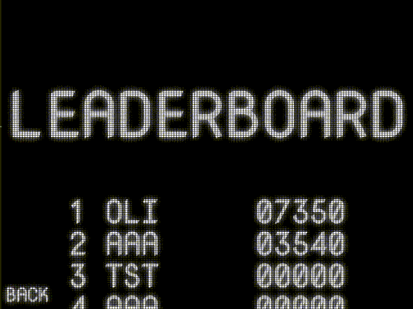

# Game-play

The game-play is run as its own screen, just like all the other different screens so far. This screen is by far the most complex, having a handful of classes I made specifically for it.

## Game Objects

I decided to make a base class for every object in my game that will be in the game world. I took some inspiration from Unity and named this class game engine. Being a generic base class, it doesn't contain too much logic on it’s own.

All game objects have a rotation and a position which are applied in a “transform” function

```jsx
transform() {
  translate(this.position);
  rotate(this.rotation);
  this.wrapPos();
}
```

All game objects also have a “warpPos” function, which is the most complex thing in the base class. This function allows the objects to wrap around the screen if they reach an edge. Every single object should have this behavior which is why it’s built in here.

```jsx
wrapPos() {
  if (this.position.x > this.bounds.x + this.size) {
    this.position.x = 0 - this.size;
    return true;
  } else if (this.position.x < 0 - this.size) {
    this.position.x = this.bounds.x + this.size;
    return true;
  }

  if (this.position.y > this.bounds.y + this.size) {
    this.position.y = 0 - this.size;
    return true;
  } else if (this.position.y < 0 - this.size) {
    this.position.y = this.bounds.y + this.size;
    return true;
  }
  return false;
}
```

Finally, each game object has an empty “collide” function. This function will contain the logic that the child classes should carry out upon collision, but in this generic form it remains empty.

```jsx
collide() {}
```

### Asteroid

The asteroid class starts by generating a shape for the asteroid. My version of asteroids uses vector graphics much like the original, and so I can simply generate a shape for the asteroid by using noise to control the distance of the points from the center of the object.

As a bonus the noise is sampled in a circle, which ensures that the start and end point will always meet up.

```jsx
//generate a roundish shape as an array of points offset by noise
generateShape() {
  for (let i = 0; i < this.resolution; i++) {
    let x = 1 * cos((TWO_PI / this.resolution) * i);
    let y = 1 * sin((TWO_PI / this.resolution) * i);
    let n = noise(
      (x + 0.5) * this.noiseScale,
      (y + 0.5) * this.noiseScale,
      random(10)
    );
    n = map(n, 0, 1, 0.5, 1);
    this.points.push(createVector(x * this.s * n, y * this.s * n));
  }
}
```

This shape is not yet drawn to the screen, but will be drawn when the asteroid’s position has been updated. When it’s time to draw the shape, I will simply loop through the array of points I generated and draw lines between each one

```jsx
//draw the generated shape
draw() {
  noFill();
  strokeWeight(4);
  beginShape();
  for (let i = 0; i < this.points.length; i++) {
    vertex(this.points[i].x, this.points[i].y);
  }
  endShape(CLOSE);
}
```

When the asteroids are created, I assign them a random rotation, and they will always move forwards based on that rotation.

```jsx
//add some amount to the position vector
update() {
  push();
  this.transform();
  let x = 1 * cos(this.rotation);
  let y = 1 * sin(this.rotation);

  this.position.add(createVector(x, y).mult((1 - this.s / 100) * 2));
  this.draw();
  pop();
}
```

The main complexity of the asteroids comes from their collision behavior. When an asteroid is hit, it should split into a smaller asteroid, and this process should repeat itself to give three distinct sizes of asteroid.

I keep track of the generation of asteroid, starting at two and approaching zero as they get smaller.

When the asteroid is hit, I create the two smaller asteroids with a decremented generation, and I delete the current asteroid from the master array of game objects.

```jsx
//when collided with, create two asteroids of a smaller generation, unless this astroid is of generation 0
//remove this asteroid from the objects array
collide() {
  this.sounds.playSound("hit");
  if (this.generation != 0) {
    for (let i = 0; i < 2; i++) {
      this.objects.push(
        new Asteroid(
          this.bounds,
          this.objects,
          this.position.copy(),
          this.rotation + (PI / 4) * i,
          (this.s / 3) * 2,
          this.generation - 1,
          this.sounds
        )
      );
    }
  }
  let index = this.objects.indexOf(this);
  this.objects.splice(index, 1);
}
```

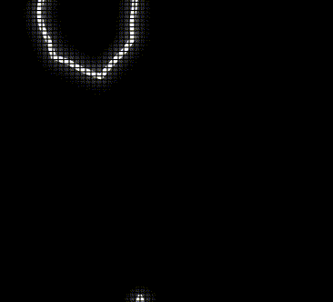

### Bullet

The bullet class is probably the simplest of the game object derived classes. There were a couple of special bits of code I had to add in order to get them working correctly.

The first special addition is a tag, this tag is simply a string which will tell the collisions object what object this bullet originated from. Both the player and enemy saucers can shoot bullets, and this helps ensure they don’t get hit by their own bullets.

```jsx
this.tag = tag;
```

The “collide” function for the bullet is very similar to that of the asteroid. It simply adds some screen shake and promptly deletes itself from the master array of game objects. This then stops it from existing altogether.

```jsx
//when collided with, add some screenshake and remove from objects array
collide() {
  this.screenShake.add(5);
  let index = this.objects.indexOf(this);
  this.objects.splice(index, 1);
}
```

The bullet will then travel at a fixed rate in the direction in which it was shot. Once a predetermined amount of time passes, the bullet will once again remove itself from the master array of game objects and be deleted.

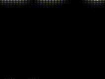

### Saucer

The saucers are are a type of enemy that can shoot at the player. Like asteroids they will move in a single direction looping around the screen until they are destroyed. The special ability of the saucers are that they can shoot at the player.

The saucers are supposed to have two different types, a larger one that moves slower and is less accurate, and a smaller one that moves quicker and is more accurate.

As the player’s score increases, the accuracy of the saucers also increase.

```jsx
if (this.score == undefined) {
  //regular aim, based on the size of the saucer
  rotationRange = (TWO_PI / 360) * this.size;
} else if (this.score <= this.scoreThreshold) {
  //aim gets better as score gets closer to the score threshold
  rotationRange =
    (TWO_PI / 360) * this.size * (1 - this.score / this.scoreThreshold);
} else {
  //gives 1 degree of random rotation
  rotationRange = TWO_PI / 360;
}
```

When the saucer has aimed, it will shoot once every predetermined amount of seconds.

If the player’s score is high enough, the saucers will even start taking in the player’s velocity as a factor in their aiming direction.

```jsx
//if the score threshold is high enough, start factoring in target velocity
if (this.score > this.scoreThreshold) {
  this.rotation = atan2(
    this.target.position.y + this.target.velocity.y * 20 - this.position.y,
    this.target.position.x + this.target.velocity.x * 20 - this.position.x
  );

  print(this.target.velocity);
}
```

When the saucer detects a collision, it simply triggers some sound queues and removes itself from the master array of all game objects.

```jsx
collide() {
  this.sounds.playSound("hit");
  this.sounds.saucerExit();
  let index = this.objects.indexOf(this);
  this.objects.splice(index, 1);
}
```

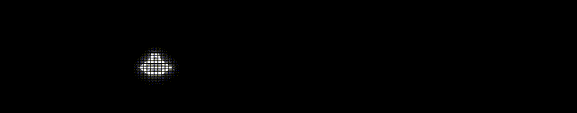

### Ship

The ship is the object the player controls. The basis behind the ship’s movement is a simple physics model. When the player holds down the “W” key, The player gains velocity in the direction they are facing.

```jsx
//get input ('w' key)
if (keyIsDown(87)) {
  this.sounds.startThrust();
  let x = 1 * cos(this.rotation - PI / 2);
  let y = 1 * sin(this.rotation - PI / 2);
  this.acceleration.add(createVector(x, y).div(100));
  this.drawThruster();
  this.invincible = false;
} else {
  this.sounds.stopThrust();
  this.acceleration = createVector(0, 0);
}
```

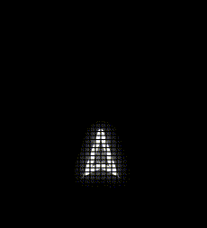

The player can additionally turn by using the “A” and “D” keys.

```jsx
//when a or d is pressed
//add rotation acceleration to the rotation velocity
//add the rotation velocity to the rotation of the object
turn() {
  if (keyIsDown(65)) {
    this.rAcceleration -= (PI / 180) * 0.07;
    this.invincible = false;
  } else if (keyIsDown(68)) {
    this.rAcceleration += (PI / 180) * 0.07;
    this.invincible = false;
  } else {
    this.rAcceleration = 0;
  }
}
```

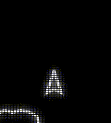

This comes together to make the basic player movement, but the player does have an additional movement ability. The player can press “shift” to teleport to a random position on the screen.

During the frame that the player teleports I draw a line from their old position to their new one. I found this trail helped me keep track of where the player was after the teleport.

```jsx
//when shift is pressed, move the ship to a random position
teleport() {
  if (
    keyIsDown(16) &&
    millis() / 1000 > this.teleportTimer + this.teleportCooldown
  ) {
    this.sounds.playSound("teleport");
    let newPos = createVector(random(this.bounds.x), random(this.bounds.y));
    let lastPos = this.position.copy();

    //trail effect to keep track of where the ship is better
    push();
    rotate(-this.rotation);
    line(0, 0, newPos.x - lastPos.x, newPos.y - lastPos.y);
    pop();

    this.position = newPos;

    this.teleportTimer = millis() / 1000;
    this.invincible = false;
  }
}
```


The player of course also has the ability to shoot. When the player presses “space” the ship attempts to shoot. I keep track of a timer to keep the player from shooting too fast, but as long as the player has waited long enough they should be able to shoot.

Upon shooting I apply a small amount of backwards velocity to the ship, which acts as a recoil. The screen also shakes and a sound is played to complete a satisfying shot.

```jsx
//when space is pressed
//if the you have waited for the cooldown
//create a new bullet and add it to objects array
//also add some backwards velocity
shoot() {
  if (keyIsDown(32) && millis() / 1000 > this.shotTimer + this.shotCooldown) {
    this.sounds.playSound("shoot");
    let x = 1 * cos(this.rotation - PI / 2);
    let y = 1 * sin(this.rotation - PI / 2);
    let dir = createVector(x, y);
    this.objects.push(
      new Bullet(
        this.bounds,
        this.objects,
        this.position.copy().add(dir.copy().mult(20)),
        this.rotation,
        this.screenShake,
        "ship"
      )
    );
    this.velocity.sub(dir);
    this.shotTimer = millis() / 1000;
    this.invincible = false;
  }
}
```


## Collisions

All of the collisions in the game are handled by one central object. This object has a list of every game object and will compare the positions of each, triggering some logic when they get too close.

I have a few objects that are set not to interact with each other. Asteroids do not collide with other asteroids, nor ships with their own bullets, nor bullets with other bullets.

I also have an invincibility state for the player ship. When the player spawns in, they are invincible until they add some sort of input to the ship. This was added because sometimes the ship would re-spawn on top of an asteroid and the player would die instantly.

Once I have properly ignored all of the collisions I want to, I move on to collision interactions that actually do things. The interactions that are directly triggered within the collisions class are only those that relate to the player’s score. All other interaction are called via a “collide” function that every game object has.

The first of these is when a player bullet hits an asteroid, this will increase the player score by a set amount based on the size of the asteroid hit.

```jsx
if (a instanceof Bullet && b instanceof Asteroid) {
  if (a.tag == "ship") {
    this.addPoints(b);
  }
}
```

```jsx
addPoints(asteroid) {
  switch (asteroid.generation) {
    case 2:
      this.score.value += 20;
      break;
    case 1:
      this.score.value += 50;
      break;
    case 0:
      this.score.value += 100;
      break;
  }
}
```

I also have some separate code which does a similar thing for the small and large saucers while just having different score values for each.

```jsx
//if a bullet hits a saucer, add points
if (a instanceof Saucer && b instanceof Bullet) {
  if (b.tag == "ship") {
    if (b.size > 30) {
      this.score.value += 200;
      print("large");
    }
    if (b.size < 30) {
      this.score.value += 1000;
      print("small");
    }
  }
}
```

Once all of the score based collision events happen, the code continues to run the “collide” function in both of the objects that have collided.

```jsx
//have both the a and b objects run their collide methods
a.collide();
b.collide();
```

The collisions class also handles triggering the re-population of asteroids once all of them have been destroyed. This s done by checking if there are any asteroids in the game objects array, and if there are none, calling a re-populate function from the game screen control script.

## Screen Shake

I created the screen shake object as a simple way to add a little extra juice to the game. The class operates on the idea of having a certain amount of amplitude, and shaking based on that amount while it decreases over time. This way any object can add screen shake to the screen, and if multiple of them try to add shake at the same time, it will simply result in a more aggressive and longer lasting effect.

```jsx
//makes the amplitude smaller every frame
if (this.amplitude > 0) {
  this.amplitude *= 0.9;
} else {
  return; //if the amplitude is smaller than or = 0 do nothing
}
//create a random vector every frame
this.v.x = random(-1, 1);
this.v.y = random(-1, 1);
//set the magnitude of the random vector to the desired amplitude
this.v.setMag(this.amplitude);
//translate based on the vector
translate(this.v);
```

The screen shake translation is applied within a push/pop context along with the updating of game objects. Doing this ensures that the screen shake doesn't affect any of the UI elements keeping them easily readable.

```jsx
//apply screenshake in push pop context so that it dosent affect the hud
push();
this.screenShake.update();
for (let i = 0; i < this.objects.length; i++) {
  this.objects[i].update();
}
pop();
```

## UI

The game has a simple UI consisting of a score counter as well as a lives counter. Both of these are made by drawing text to the screen, and in the case of the lives character, using a special unicode character I found to represent the lives.

```jsx
//draw the player's score on the screen
drawScore() {
  textSize(50);
  textAlign(RIGHT);
  text(nf(this.score.value, 5), this.bounds.x - 25, 25);
}
```

```jsx
//draw the player's lives on the screen
drawLives() {
  push();
  textFont("Courier New");
  textSize(50);
  textAlign(LEFT);
  text("⛯".repeat(this.ship.lives + this.extraLives), 25, 40);
  pop();
}
```

# Sounds

I decided to control sound playback from a central object. A lot of the sounds needed to have some sort of transition and so I decided to lighten the load on my game objects and put that logic within a central manager. The game objects can then call specific functions from the sounds object, and that will trigger the playback of the desired sounds.

# Conclusion

I have left out some details from this explanation of my asteroids project for the sake of brevity. If you would like to take a closer look at all of my code, feel free to look at the publicly available source code.
If you would like to play the game, feel free to do so using the link below. Fair warning, just like the original asteroids, my implementation can be quite challenging.

<p class="text-center">




</p>
