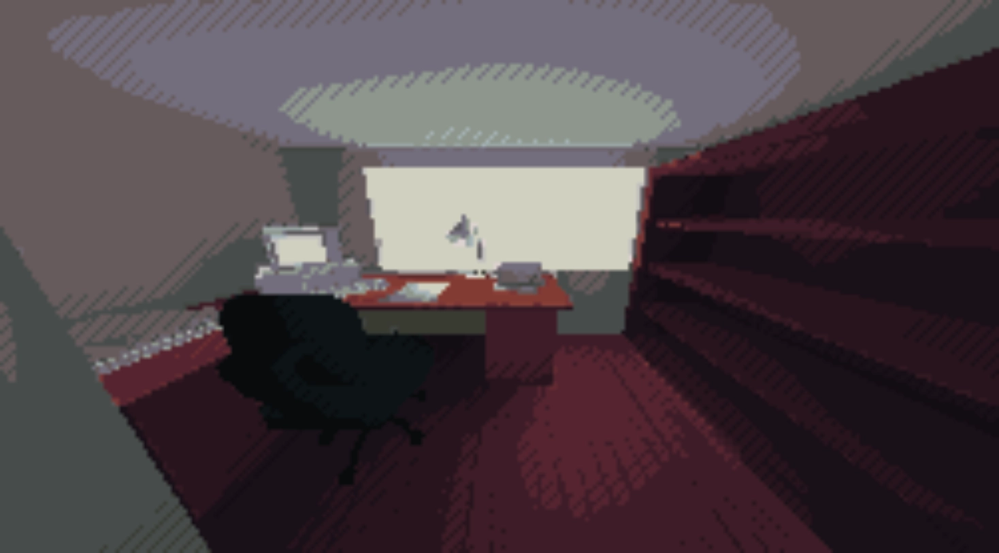

# Dialogue System

Earlier this year, I started working on a game with a couple of friends of mine. The game in question was set to be inspired by point and click adventure games, but set in a full 3D environment and with an unsettling horror twist. One of the big mechanics we wanted to implement was a dialogue system, being able to interact with characters in the world and have them speak to you was going to be a core piece of our game play loop.



*Above is a work in progress picture of a room from the game.*

A dialogue system is typically a pretty easy thing to implement with help from the Unity UI system. Unfortunately for our game, we wanted a more stylized text system. Inspired by the idea of having text that jitters up and down, or a rainbow effect to give the text more character. After looking into using the unity built in text solution, I found that there was no obvious support for applying shaders to text which is what led me to building my own text solution.

# Underlying Systems

A dialogue system on its own is functionally useless. Having a way to store all the text and variables, trigger the dialogue and to display the text is integral to a dialogue system.

## Dialogue Storage

In this project, we opted for storing dialogue in JSON files. The file is designed to have all the information that would be needed to personalize the text for each interaction, as well as having multiple instances of the information to create a conversation out of the individual dialogue instances.

The JSON file is formatted to contain an array of dialogue objects, these objects each contain-ing 5 values which are as follows:

The text is a simple string that can contain special characters to define the use of a shader, these special characters would have to be surrounding the text you want affected.

```json
"text":"~This text will wiggle,~ this text will not"
```

Next is the voice which is also a simple string. It will later refer to a set of sounds associated with the voice, as one of my friends is in charge of the sound design, i am not entirely sure of the specifics of how this referral happens.

```json
"voice":"driver"
```

The delay is a float that represents the time between when the characters will appear in the typing effect of the dialogue.

```json
"delay":"0.1"
```

The volume is another float that, in this case affects how loud the sounds previously defined in voice are.

```json
"volume":"0.5"
```

The color is a string that can either be an HTML color name, or a hexadecimal color code. This string will later be used to color the entire string of characters as it displays on screen.

```json
"color":"red"
```

## Interaction System

My interaction system was inspired by the unity UI button. I have two different scripts to help me handle this: the interactable script, which is to be put on any object that should be interacted with, and an interaction manager script.

The interactable script is very simple and is only on an object to hold data. That data is what state the cursor should enter while hovering over the object, which informs mainly what sprite is displaying as the cursor. It also holds the information about which methods in which scripts should be triggered, this could be anything, but in this case it is useful to imagine it triggering the dialogue.

The interaction manager script is in charge of actually making things happen. Every frame the script casts a ray from the center of the camera in the direction of the mouse. If it hits an object, it checks if that object is tagged as interactable, and if the mouse clicks while hovering over an interactable object the code referred to in that objects interactable script is triggered.

On top of that, the interaction manager is also in charge changing the sprite of the mouse cursor. This helps communicate to the player what kind of interaction they will be engaging in.


*Above is a picture of some of the cursor sprites, default, dialogue, and view*

## Text Displayer

The text displayer script is the one that does all the heavy lifting when it comes to the text being visually displayed on the screen. Its job is to read each character that it is given, and set an appropriate sprite in a readable sequence on the screen. Its job is also to parse the text to figure out where the text effect shaders should be applied.

The first thing the script does is set up a couple dictionaries. One of them is to associate each alphabetical character along with some punctuation with a sprite, and the other is to associate each special character with a shader to later apply to the text.


After that, I set up a grid of empty sprites. The size of these sprites is decided in such a way that each pixel of the sprite is one pixel on the screen, I do this to keep the pixel art aesthetic of the game. I add a small amount of spacing between each letter, and the grid is organized automatically by a grid layout group on the UI canvas that displays the text.

Once all of that setup is done, the script is ready to receive text. The text is set to be received in a public method called “UpdateText” which simply takes a string.

At the start of the method I clear the previous text, which involves iterating over each sprite and making sure it is empty.

Then I take the sting and go through a process that organizes the words with the right amount of padding to have no word broken up by a line break. The spaces account for the special characters which will later be omitted, and the new string is returned back to the previous method.

After the padding is added to the string, I parse it for special characters. If one of the previously defined special characters is found, I start applying a shader to the sprites, once the character is found again, i go back to using the default shader.

Once the string is fully formatted, I do a couple of checks to make sure there are enough sprites to contain all of the text characters. If there aren't enough sprites, I use the previous string in the system. If there are enough, I use the new string and set all of the sprites to their proper image.

## Dialogue Manager

The final piece of this puzzle is the dialogue manager script. This script is what the interaction system will call, and what the dialogue storage is passed to.

When the script is called on, it looks at the JSON file and applies all the information to variables in the script.

Then a coroutine is started. This coroutine sends one letter from the provided text to the text displayer each time it runs. After each letter is added, the coroutine calls on itself again until we run out of letters, with a delay between each run;

There is also a piece of code that runs each frame, if the player clicks their mouse while the coroutine is running, Then it stops the coroutine and sends the finished text to the text display-er. If the mouse is clicked once the text is done being sent, either manually by the player or if the coroutine runs to its end, the text is advanced to the next text in the dialogue array. If the dialogue array has no more elements, the text is cleared and the player is free to interact with elements in the world again.