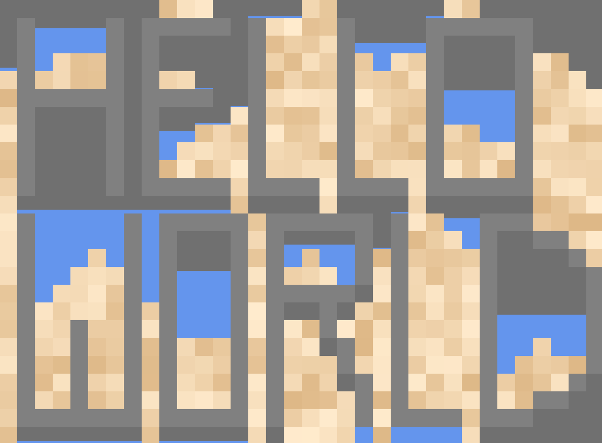

# Falling Sand p5js

I’ve always loved working with 2D arrays, and so when I found out about cellular automata a sort of fascination was born. Last year I built Conway's game of life, but this year I discovered to possibility of making a falling sand simulation using the same principles. Then upon diving deeper, I discovered the possibility of making a water simulation which I became obsessed with for a couple months.

In this post I will be detailing how I architected my simulation using object orientation, and the rules that went into getting my elements behaving in a realistic fashion.



## Architecture

Like most p5js sketches, most of my code that actually runs is in the sketch. js file. I start my sketch with a few variables, most of which are for basic setup.

```jsx
let scaleFactor = 50; //the pixel size of each cell in the simulation
let grid = []; //where the particles live
let dimensions; //(x,y) dimensions of grid. Used because grid is a 1D array 
let cnv; //refference to canvas for resizing
let cycle = 0; //keeping track of the current step in the simulation
```

In my setup function, I then call a supplementary function to scale the canvas properly to the screen size.

```jsx
function setup() {
  cnv = createCanvas(0, 0);
  dimensions = createVector(0, 0);
  scaledCanvas();
}
```

The scaled canvas function is used to set the dimension of the canvas to a number of pixels divisible by the scale factor.

 In this function, I also initialize the array of particles with ‘Air’ particles and retain any non-air particles that would already be set.

I have the array retain set particles because I call the same function whenever the screen resizes, and having all of your hard work disappear felt jarring, which is why I implemented the feature.

```jsx
//scales the grid to match the canvas size, while preserving the already filled cells
function scaledCanvas() {
  let w = windowWidth - (windowWidth % scaleFactor);
  let h = windowHeight - (windowHeight % scaleFactor);

  //get copy of old dimensions for preserving already filled cells
  let oldDim = dimensions.copy();

  dimensions = createVector(w, h);
  resizeCanvas(dimensions.x, dimensions.y);
  dimensions.div(scaleFactor);

  //create new grid with all black particles
  let newGrid = new Array(dimensions.x * dimensions.y);

  //add particles from old grid to new grid
  for (let i = 0; i < dimensions.x * dimensions.y; i++) {
    let x = i % dimensions.x;
    let y = floor(i / dimensions.x);

    if (oldDim.y > y && oldDim.x > x) {
      newGrid[i] = grid[y * oldDim.x + x];
    } else {
      newGrid[i] = new Air();
    }
  }

  //apply new grid as grid
  grid = newGrid;

  //center canvas on screen
  let cnvX = (windowWidth - width) / 2;
  let cnvY = (windowHeight - height) / 2;
  cnv.position(cnvX, cnvY);
}
```

Now that we have the array of particles set, we can move on to the draw function, which is called every frame the game runs.

```jsx

function draw() {
  background("rgb(112,112,112)");
  scale(scaleFactor);

  noStroke();

  for (let i = 0; i < grid.length; i++) {
    let x = i % dimensions.x;
    let y = floor(i / dimensions.x);
    
    push();
    translate(x, y);
    grid[i].render();
    pop();

    if (grid[i].cycle != cycle) {
      continue;
    }

    grid[i].setNeighbours(grid, i);

    let updateVector = grid[i].update();
    let newPos = createVector(x, y).add(updateVector);
    let newIndex = newPos.y * dimensions.x + newPos.x;
    
    if(updateVector.mag() == 0){
      continue;
    }
    
    let a = grid[i];
    let b = grid[newIndex];
    
    grid[newIndex] = a;
    grid[i] = b;
    
    b.update();
    
  }
  cycle++;
}
```

The grid is a one-dimensional array for performance reasons, which I access as a two-dimensional array.

I render each cell at its grid position on the screen every frame. Then I continue to apply the cellular automata rules to each cell based on what kind of material is contained in it. The cell rules always return a vector, which I use to swap that cell with the one where the vector points.

I also keep track of a cycle value during the update, every fame I increment it to keep track of how many updates have passed. I have the same value for each cell, and it is increased when the cell provides its vector. This makes sure that each cell can only ever be updated once per frame.

If I didn't add this provision, a falling piece of sand could go from the top to the bottom of the screen in a single frame, because it would continue to get updated in the for loop as it falls. I’ve seen some other implementations where you go over the loop from bottom to top, but this can still result in problems if a cell moves upwards.

## Particle Base Class

Everything that can populate my grid of cells is what I call a particle. They all derive from the same base class which includes some simple base functionality.

The base particle contains a few variables in its constructor that every other particle is going to need.

```jsx
  constructor() {
    this.density = 0;
    this.col = "black";
    this.neighbours = Array(9);
    this.cycle = cycle;
  }
```

Density is a number between 0 and 1. The higher the density, the further down it’ll sink. For example, later I’ll be setting sand as denser than water, which means sand will sink and water will rise.

Col is simply the colour of the particle, neighbours are an array of cells, specifically the ones that surround this current cell, and cycle keeps track of the update cycle as detailed above.

I also have a couple of simple stubs of functions that will be elaborated on in the child classes.

```jsx
  render() {
    fill(this.col);
    rect(0, 0, 1, 1);
  }

  update() {
    this.cycle++;
  }
```

The brunt of the code for the base particle is spent gathering the neighbours of the cell.

```jsx
  setNeighbours(grid, index) {

    //index of the current cell expressed as x,y coords
    let x = index % dimensions.x;
    let y = floor(index / dimensions.x);

    for (let i = 0; i < this.neighbours.length; i++) {
      //index from -1,-1 to 1,1
      let neighbourX = (i % 3) - 1;
      let neighbourY = floor(i / 3) - 1;

      //add together
      let calcX = neighbourX + x;
      let calcY = neighbourY + y;

      //set to null if index is out of bounds
      if (calcX < 0 || calcX > dimensions.x-1 || calcY < 0 || calcY > dimensions.y-1) {
        this.neighbours[i] = null;
        continue;
      }

      //add cell to neighbours array
      this.neighbours[i] = grid[calcY * dimensions.x + calcX];
    }
  }
```

I get each neighbouring cell from the grid and add them to the array. If the cell is outside the bounds of the grid, I set the cell to null, and have code to take care of those cases in my rules for my more complex particles.

## Air

Air is one of my simplest particles. It’s the particle which fills the grid by default

```jsx
class Air extends BaseParticle {
  constructor() {
    super();
    this.density = 0;
    this.col = "rgb(112,112,112)";
  }

  update() {
    super.update();
    return createVector(0, 0);
  }
}
```

It has 0 density, which ensures anything else will be able to fall through it, and when updated, it’s always set to stay in the same position.

## Steel

Steel is equally as simple as air. It’s a solid immovable particle.

```jsx
class Steel extends BaseParticle {
  constructor() {
    super();
    this.density = 1;
    this.col = "grey";
  }
  
  update(){
    super.update();
    return(createVector(0,0))
  }
}
```

A density of 1 will stop any other particle from falling through it. Same as air it stays in the same position when updated.

## Sand

Sand is where the particles start getting more complex. 

```jsx
  constructor() {
    super();
    this.density = 0.5;
    this.col = lerpColor(color("BlanchedAlmond"), color("BurlyWood"), random())
  }
```

The constructor already has some added complexity. A density of 0.5 means the sand will fall through air, but will be stopped by steel. I set the colour of the sand as random between two colours for some added variation in the texture of the sand.

```jsx
update() {
    
    super.update();
    
    //check cell directly below
    if(this.neighbours[7] != null && this.neighbours[7].density < this.density){
      return(createVector(0,1))
    }
    
    //get status of relevant neighbouring cells
    let bottomLeftEmpty = (this.neighbours[6] != null && this.neighbours[6].density < this.density);
    let bottomRightEmpty = (this.neighbours[8] != null && this.neighbours[8].density < this.density);
    let leftEmpty = (this.neighbours[3] != null && this.neighbours[3].density < this.density);
    let rightEmpty = (this.neighbours[5] != null && this.neighbours[5].density < this.density);
    
    //sudo randomly decide where to go if there are two options
    if(bottomLeftEmpty && bottomRightEmpty && leftEmpty && rightEmpty){
      if(frameCount%2 == 0){
        return(createVector(-1,1));
      }else{
        return(createVector(1,1));
      }
    }
    
    //go down and to the left
    if(leftEmpty && bottomLeftEmpty){
      return(createVector(-1,1))
    }
    
    //go down and to the right
    if(rightEmpty && bottomRightEmpty){
      return(createVector(1,1))
    }
    
    //go nowhere
    return(createVector(0,0));
    
  }
```

The update function is expanded to add rules to make the sand fall. First by checking if there is anything less dense directly below it. Next, I set some booleans to check the cells directly beside and diagonally downwards from the current sand. With these booleans, I’m able to easily check which neighbouring cells are less dense and move the sand accordingly.

## Water

Water is by far the most complex particle of them all. 

```jsx
  constructor() {
    super();
    this.density = 0.3;
    this.fullness = 1;
    this.visualFullness = this.fullness;
    this.col = color("CornflowerBlue");
  }
```

The constructor for water gets a couple of its own exclusive variables, these being fullness and visual fullness. Fullness is a 0 to 1 value which describes how much water is in a cell. Visual fullness is a value that usually mirrors fullness, but when the particle is falling it’s set to 1 which makes the cell visually full. This is simply to help with the visual aspects of the falling water.

```jsx
  render() {
    fill(this.col);
    rect(0, 1 - this.visualFullness, 1, this.visualFullness);
  }
```

In the render function, I add some extra code to let me render a partially full cell.

```jsx
    if (this.neighbours[7] != null && this.neighbours[7].density < this.density) {
      this.visualFullness = 1;
      return createVector(0, 1);
    }
```

Water can only ever move downwards. It does so the same way the sand does.

The rest of the water functionality involves what I call flowing. Flowing is a fractional change in the way the water moves. For example, if the cell beside the water is empty, the water will give that cell 50% of its fullness.

```jsx
    if (this.neighbours[5] instanceof Air) {
      this.fullness /= 2;

      let newWater = new Water();
      newWater.fullness = this.fullness;
      newWater.update();
      grid[grid.indexOf(this.neighbours[5])] = newWater;

      return createVector(0, 0);
    }
```

If the neighbour has water, the current cell can also flow into it by averaging the amount of water between the two of them.

```jsx
 if (this.neighbours[5] instanceof Water) {
      this.fullness += this.neighbours[5].fullness;
      this.fullness /= 2;
      this.neighbours[5].fullness = this.fullness;

      return createVector(0, 0);
    }
```

These rules are applied for every direction the water can flow.

## Conclusion

I had a lot of fun working on this project and would love to someday expand it with more elements and interactions between them like in the Noita. My love for 2D arrays persists, and I can’t wait to find the next thing I can do with them.

## Live Demo

<div style="width: 100%; height: 500pt; overflow: hidden">
  <iframe width="100%" height="110%" src="https://editor.p5js.org/OlivierProulx/full/iXwAmKx7H" style="position: relative; top: -50px" frameBorder="0"></iframe>
</div>

### Instructions

| Left Click | Place Sand |
| Middle Click | Place Steel |
| Right Click | Place Water |
| Shift Click | Erase Cell |

