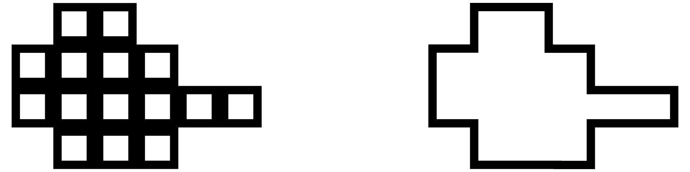
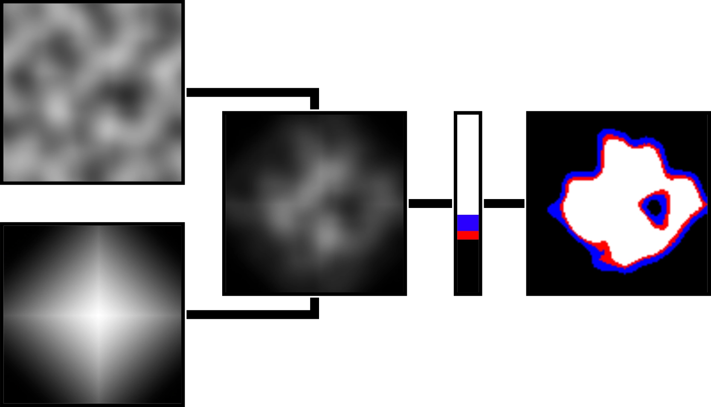
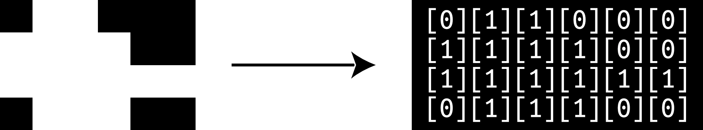
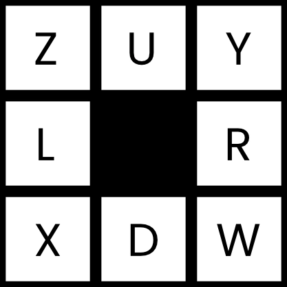
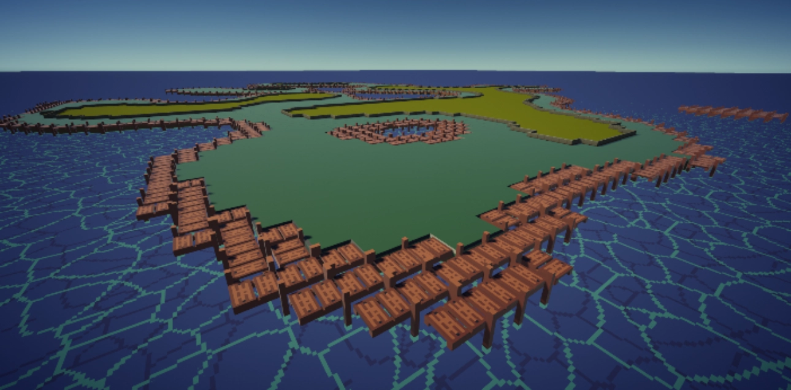

# 3D Rule Tile System

Every solution starts with a problem, in this case, my problem had to do with the limitations of the unity rule tile system. A rule tile system is a system that automatically selects and orients a series of tiles placed inside of a grid based on a set of rules decided by a user.



*On the left is an example of an un-tiled group of tiles, on the right is a tiled grouping of tiles which could be achieved either manually or more quickly with a rule tile system.*

## Why use rule tiles?

A rule tile system is a powerful tool to more efficiently create large 2D environments. Although it is possible and not too much more time-consuming to do this manually, rule tiles truly shine when used in conjunction with procedural generation. Having the ability to select and orient tiles correctly and automatically in a world that is generated by a computer is a great way of creating a good-looking procedural world.

## What is the problem?

My problem lies with the fact that the unity rule tile system has no obvious support for 3D, and through all of my research I could not find any way of using 3D. So I decided to make my own version of a rule tile system so I could create a 3D world.


*Above is an example of what the result of a 3D rule tile system Might look like.*

## Where to start?

When making a system within a game, it is important to consider how the system will be organized. I opted for having four individual scripts that each handle a different step in my system.

These scripts are as follows:

- Random Level Generator
- Map Interpreter
- Rule Encoder
- Map Loader

Although not all of these steps are necessary for a rule tile system, because I was integrating
the system into a procedural generation system, a more complex pipeline was developed.

### Random Level Generator

The random level generator is in charge of creating the input for my rule tile system. The basic role of this script is to generate an image that can later be transformed into a 3D scene. If I wanted to. I could draw the image myself instead of having it generated by a script, but I opted to have it procedurally generated for me in order to save time in making a variety of levels. 

The script starts by initializing a texture that has a width and height that can be set in the game engine. The texture is entirely black and will be modified in later steps of the script.

```csharp
public int width = 100;
public int height = 100;
```

```csharp
public Texture2D Initialize(int w, int h)
{
	Texture2D texture = new Texture2D(w,h);

	for (int x = 0; x < texture.width; x++)
	{
		for (int y = 0; y < texture.height; y++)
		{
			texture.SetPixel(x, y, Color.black); 
		}
	}
	return texture;
}
```

This new black texture will be passed into the main function in this script. The next steps will be to colour in the areas of the texture that should be filled by tiles in the final product. I start this process by using a for loop to go over each pixel, and set the colour to a shade of gray based on a Perlin noise function.

Once a pixel is set to a shade of gray, I multiply it with a pixel in the same location in a fall-off map that is generated to be the same size as the original black texture. Then I take the multi-plied pixel and evaluate its value to a gradient. If the pixel is black, it counts as 0% along the gradient, and if a pixel is white it counts as 100% along the gradient.

Although I only really need to have a gradient that contains pure black and pure white for my system to work, I decided to add support for multiple colours where each colour could later correspond to a different rule tile. For example in the image seen below, the white could repre-sent grass, the red could be a rocky area, and the blue could be sand.



The Perlin noise map simply uses a function built into the unity engines math function library.

```csharp
float sample = Mathf.PerlinNoise(xCoord, yCoord);
```

The xCoord and yCoord variables correspond to the position of the pixel in the original texture modified by a random offset, and scaled by a factor chosen in the inspector.

The fall-off map is generated by looking at the proximity of a pixel to the center of the texture, where the closer to the center the whiter the pixel is.

```csharp
float newX = x - (w / 2), newY = y - (h / 2);
float value = 1 - ((Mathf.Abs(newX) / w) + (Mathf.Abs(newY) / h));
Color color = FallOffGradient.Evaluate(value);
texture.SetPixel(x, y, color);
```

Then I evaluate the value of the pixel to a to a gradient so I can have finer control over how sharp or soft the falloff should be.

### Map Interpreter

The map interpreter is the script that is in charge of the rest of the scripts. Its job more specifically is to call each script and provide the correct information generated from one script into the next.

The script contains an extra class to assign each colour from the image generated in the random level generator script to a tile.

```csharp
public classTilesColor
{
	public RuleTileSO tile;
	public Color color;
}
```

```csharp
public TilesColor[] tilesColors;
```

The script starts by getting the generated image from the random level generator. It then translates it into a 2D string array. In this array, coloured pixels from the source image are represented by 1, and black pixels are represented by 0.

```csharp
if (mapTexture.GetPixel(x,y) == color) {
	tempMap[x + 1, y + 1] = "1";
}
```

I also make sure to add a perimeter of 0 around what would be otherwise generated by directly translating the source image. This will help later because I need to check the surrounding cells around each 1 to decide the correct tile and orientation when adding it into the game world. If I didn't have the perimeter, checking the cells near the edges would cause an error for trying to read outside the array.



This step and each subsequent step are repeated once for each colour in the generated texture. This essentially creates a separate tile map for each different tile that I want to be placed in the game world.

### Rule Encoder

The rule encoder is in charge of adding more information to the cells that are filled by ones. It checks each surrounding cell and if the surrounding cell is empty, a character is added to the string of the cell whose surroundings I am checking. The character is chosen based on the position of the empty cell in relation to the filled one.



This is done by checking first if the four cardinal directions (U, D, L, R), and if the cells are empty. Then based on the information gathered in the first step, we check the corners that could also possibly be empty.

Once this process is done, the more complex map is passed back into the map interpreter and from there passed into the map loader.

### Map Loader

The map loader is the final piece of my solution. The purpose of this script is to take all the information I have processed and use it to add the 3D models into the world.

This process simply involves a very large switch statement. Since there is a relatively small amount of permutations of letters, I just have each one written out with a set output which includes to proper model, and rotation in the right location in relation to the inputted array.

```csharp
case"1ulz":
	fresh = Instantiate(tile.wall2, newVector3(x, 0, y), Quaternion.Euler(0, 90, 0), LevelHolder.transform);
break;
```

*Above is an example of a case in the switch statement.*

## Extra Information

When thinking about a comprehensive tile system, it is important to realize that you can make any shape using a small finite amount of tiles.

There are 56 possible tiles, but I didn't need to model each one because i can rotate certain tiles to achieve the same shape as others. In the end i only needed to model 14 different tiles for each tile set.


*Above are all needed tiles as viewed from the top down with red representing an edge facing an empty space.*

The way I chose to store the rule tiles was to have them in an array in a scriptable object. This approach allows me to easily drag and drop different tiles into my system once they are created. The models have to be put into the array in the same order each time, and so I opted to change the way the array displays in engine to add the above images as the names of different array elements, this way I could easily know which element corresponds to which tile.

## The Results

The result ends up looking this



In the implementation of my system shown above, the wooden dock tile was designed with only one orientation in mind while the two green tiles are a better representation of what the system is capable of. Especially with the yellow-green set in the middle showing off walls that form around the edge of those regions.

Making the modular tilesets needed to use this system ended up being a very time consuming ordeal. I think it still trumps needing to custom build the environment as one large piece, and an artist who is more dedicated to doing 3D art could probably make these sets more easily than I could.