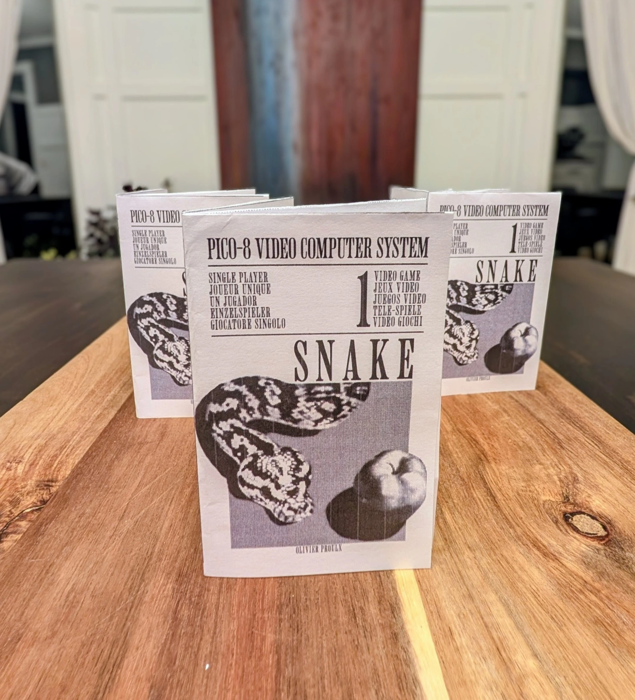
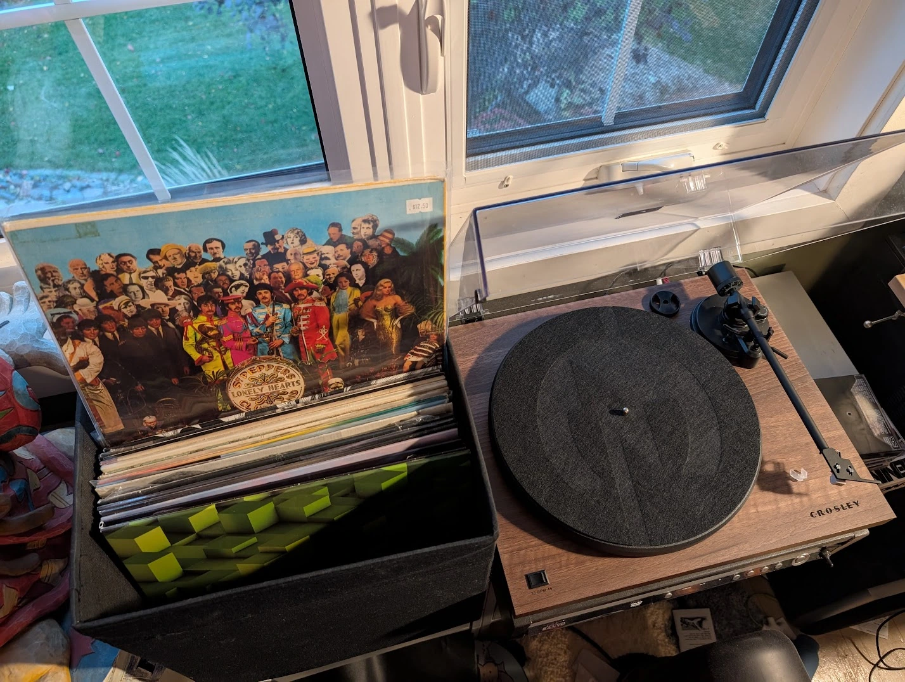
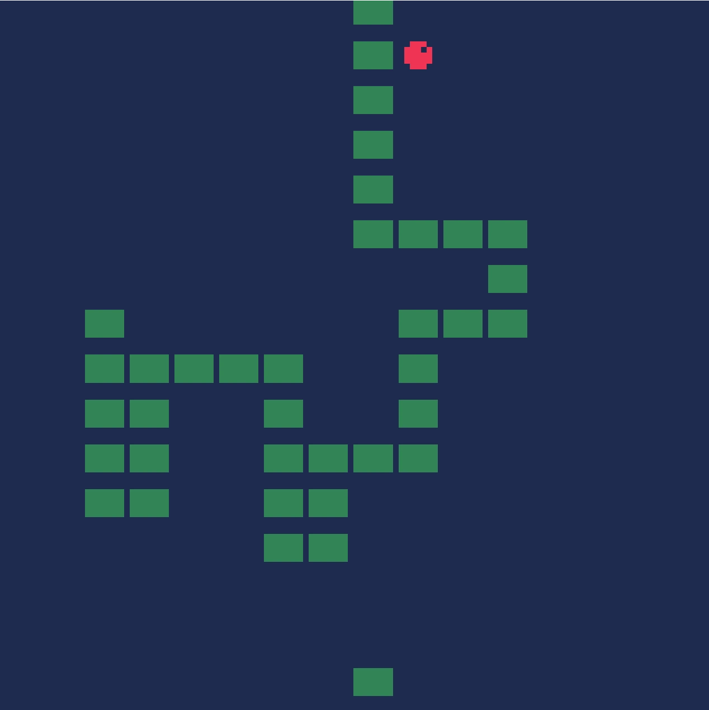
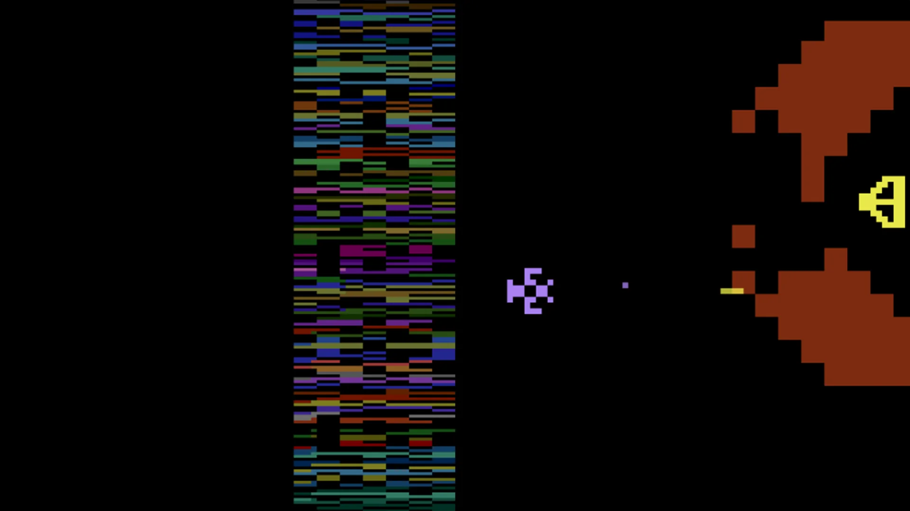
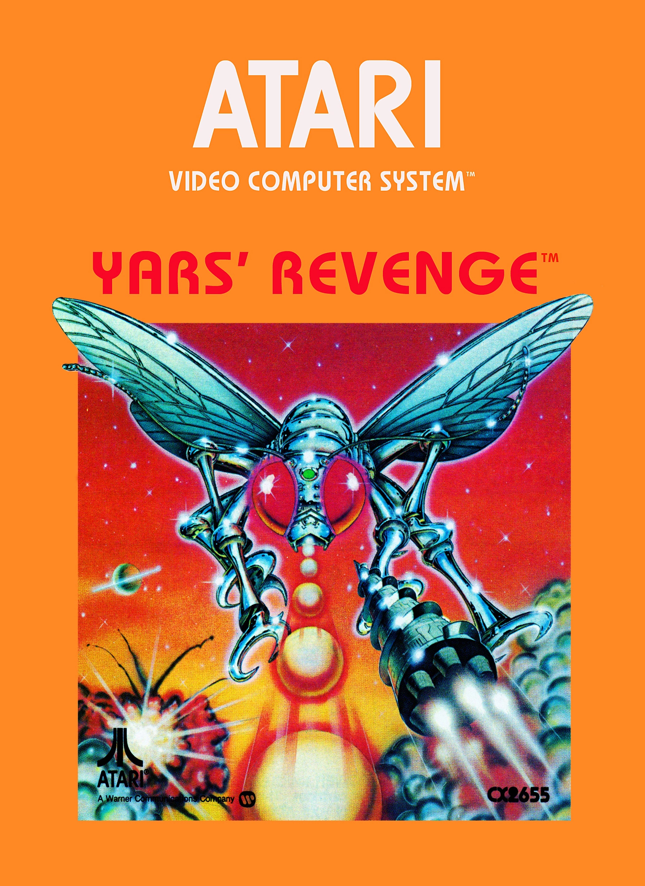
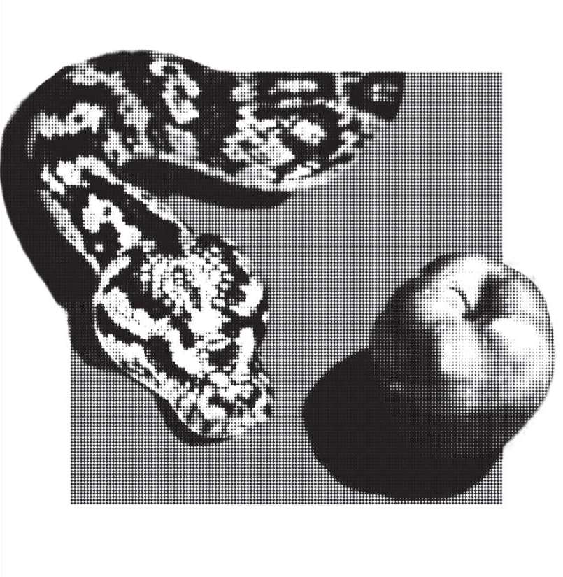
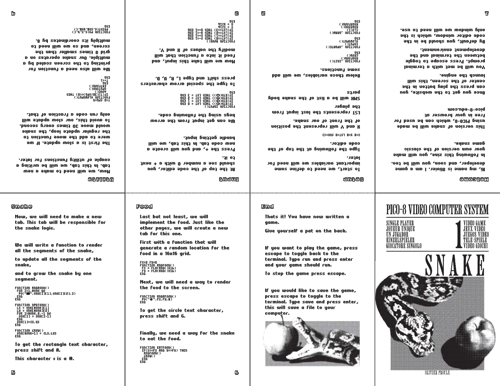

# Little Snake Zine

## Ideation
When I was growing up, digital media was on the cutting edge. I can still remember going into a Blockbuster to get a laughy taffy and rent a movie. Soon, Blockbuster was gone. Netflix and Spotify were on the rise and it seemed the era of physical media was over.

Renting digital services became popular, in large part because of the convenience it offered at one low price. As prices have risen and more companies have started their own steaming services, each service's media library has become less appealing. With a less appealing product, people are starting to think back to the good ol' days.

I too, feel that I'm no longer getting what I pay for, and have found myself turning back to DVDs, CDs and vinyl records. It both helps to show my devotion to that specific piece of media, as well as giving me a license to consume said media, whenever I want, forever.

*Above is picture of my own record collection and turntable.*

I was thinking about how this relates to games one day, and of course you can still buy physical copies of games for all major consoles. But as someone who has gamed primarily on PC I've felt a lack in the physicality of the games I own. 

That's when I thought of it, what if instead of buying a game outright, I provided a do-it-yourself kit? Similar to how table top role-playing games will have multiple large books containing rules to play the game, I thought I might be able to fit the instructions to make a digital game, in a book.

I decided to make this project as a test to see if the idea was feasible. I wanted to have a product within a week, so I decided on the 8 page zine format, to keep things small. I also needed a small game, so I searched my brain for the simplest game I could think of: Snake.

*Above is a screenshot of my final implementation of snake.*
## Making the Game
### Choosing the Platform
With snake chosen, the next big choice was what framework I was going to build it on-top of. I myself am most comfortable with Unity and Unreal, and although you could build snake in either one of these engines, the installation instructions alone would probably take up most of the 8 pages I had budgeted.

That's when I found PICO-8, which is what's known as a fantasy console. A fantasy console is an imaginary games console that has never existed physically. They are typically quite simplistic, and emulate the feel of older consoles like the NES and the Atari 2600. 

PICO-8 just so happened to also have a free, in browser educational version, which was perfect for my purposes. Free meant that anyone with a computer could follow the guide, and in browser meant there was no installation required.



### Writing Concise Code
PICO-8 uses a special flavor of the Lua programming language. I'm not super familiar with Lua, but the fundamentals of most languages are similar enough that I could get by.

When first writing the code, I just wanted to get to a minimum viable product. I didn't worry too much about making the code short, or very understandable. I just needed to know that it would work.

Once I had the snake moving, I could shift my focus to shortening the code. I believe that short code usually isn't the best code, especially in terms of understandability. Making the code super short was a sacrifice I had to make to get everything to fit in the zine. If I end up making another game-zine in the future, I would probably opt for more, larger pages to add more educational value to it.
## Design Inspiration
Wanting this project to reflect the bygone era when physical game cartridges were widespread, I looked towards graphic design from the Atari era for inspiration.

Games for old Atari systems, such as the 2600, had to face the hardware limitations of the time. These games were regarded even at the time as being quite ugly, using very blocky and pixelated graphics with a limited color palette.

*Above is what the game Yars' Revenge looked like.*

On the other hand, the cover art of the time often exaggerated what was present in the actual game. Paintings of the characters and action in the game provided a more compelling reality than what was technically possible during play. 

*Above is the cover art for the game, supposedly representing the gameplay*.

Nowadays, we tend find this dichotomy between packaging and gameplay dishonest and even a little funny. I for one, admire how the creatives of the time worked with what they had, and I wanted to capture that dichotomy in the design of this zine.

In order to capture this design, I decided to use two different visual languages. One for the cover, and the other for the content of the zine.
### Cover Art
When designing the cover of the zine, I really wanted to capture the detail and shading that these classic covers had. Although traditional art isn't my strong suit, I'm pretty good at graphic design through image manipulation. I found some nice stock images, and threw them together while adding some shadows. Because I wanted to keep printing costs low, I opted to add a halftone effect to the images on the cover. This both helped with cost by keeping things black and white, and helped with the color cohesion of the image.

I found a free font that reminded me of classic Americana. Even though the Atari boxes used a more smooth and futuristic font, I preferred my choice for this project because it helped give a more retro look.
 
 

 
### Interior Design
When designing the inside of the zine, I was thinking of it as the content of the "game". Just like how in Atari games they used blocky, pixelated graphics, I found some blocky, pixelated fonts to use for my copy.

I found three different fonts to use. One larger font for headers and footers. One more average font for most of the written content. And last but not least, I found the file for the font used in the PICO-8 text editor, which I of course used for the code.

 

 

In retrospect, the PICO-8 font is so small it borders on inaccessible for the readability of the zine. Next time, I could probably double the size of it without the zine suffering in terms of style.
## Writing the Copy
I wrote all the copy for the zine directly in InDesign. Surprisingly, it all just kind of came together. I would paste in my code, and then write instructions and explanations around it.

Again due to the size constraint of the zine, I couldn't get into too much detail about individual steps. I think that's the main point where this zine fails, even though you'll end up with a game, you probably won't understand why.
## Printing Challenges
Once I was ready to start printing, that's where the bigger challenges started to present themselves. I didn't have a home printer at the time, so I had to do all my printing on the printers at RRC. 

The trouble was that I had designed the zine to take up an entire standard page, but the RRC print release didn't let me tell the printer not to shrink my design. That meant I had to crop the paper after it had been printed.

I also found some problems with the quality of the printers, sometimes the alignment would be off, other times the resolution wasn't up to snuff.  

This all led me to eventually putting the project on hold. Until I can figure out low cost, high quality printing, I can't really move forward with this.
## Next Steps
It's not the best feeling to give up on a project like this, something that I feel so proud of. Since giving up on the project, I've learned more about zine printing, and I feel like I could make a better product if I start from scratch.

Regardless, I think I executed well on my vision, and I think I proved my concept to myself. 

Zines might not be the revolutionary future of physical game releases, but I think they certainly have a place as a collectable and educational tool.





